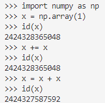

## Chapter 14 : 같은 변수 반복 사용

### 인플레이스 연산

여기에서 id(x)의 결과를 보면(x는 ndarray 인스턴스), x가 메모리에서 덮어 써지는지 아니면 새로 생성되는지 알 수 있습니다. 보다시피 누적 대입 연산자인 +=를 사용하면 x의 객체 ID가 변하지 않습니다. 즉, 메모리 위치가 동일하다는 뜻으로, 값만 덮어 쓴 것입니다. 이처럼 복사하지 않고 메모리의 값을 직접 덮어 쓰는 연산을 인플레이스 연산이라고 합니다.

## Chapter 15 : 복잡한 계산 그래프(이론 편)

위상 : 그래프의 '연결된 형태'

## Chapter 16 : 복잡한 계산 그래프(이론 편)

중첩 함수는 주로 다음 두 조건을 충족할 때 적합합니다.
- 감싸는 메서드 안에서만 이용한다.
- 감싸는 메서드에 정의된 변수를 사용해야 한다.